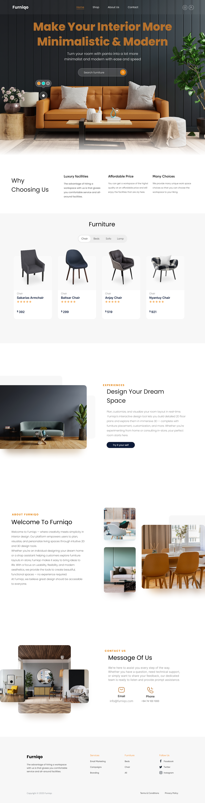
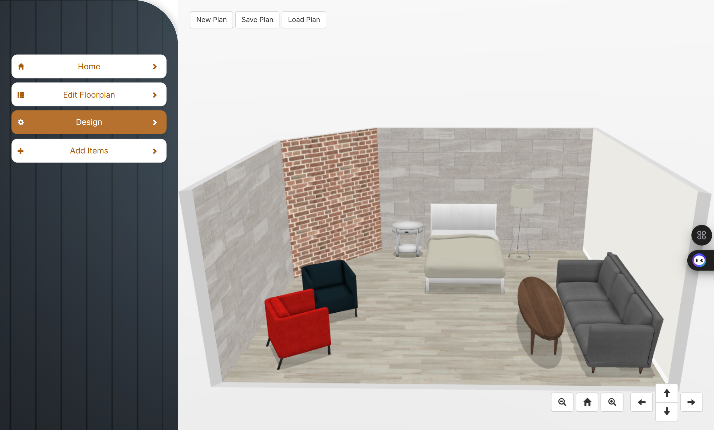

# 🛋️ Furniqo – A User-Centered Furniture Visualization and Room Customization System

Welcome to **Furniqo** — a project developed for the **PUSL3122 Human Computer Interaction (HCI)** module at the University of Plymouth.  
Furniqo is a modern platform that enables users to **design, customize, and visualize room interiors** both in 2D and immersive 3D environments, offering a smooth, realistic, and interactive experience.


---

## 🚀 Live Demo

> **🔗 Project Hosting Link:** [Visit Furniqo Live](https://your-hosting-link.com)

---

## 🎥 Demo Video

> See how Furniqo works!  
>  
>   
> *(Preview automatically plays here — no link redirection needed!)*

---

## 📂 Project Structure

```
Furniqo/
├── furniqo/         # Frontend (React.js + TailwindCSS + Framer Motion)
├── backend/         # Backend (Node.js + Express + MongoDB)
├── furniqo-3D/      # 3D Interior Design Engine (Three.js + Blueprint3D)
```

---

## ⚙️ Tech Stack

### Frontend
- **React.js** — UI Framework
- **Tailwind CSS** — Styling
- **Framer Motion** — Page Animations
- **React Toastify** — Notification Alerts
- **Vite** — Lightning-fast Build Tool

### Backend
- **Node.js** — Server Environment
- **Express.js** — API Server
- **MongoDB** — NoSQL Database
- **JWT Authentication** — Secure User Authentication

### 3D Engine (Furniqo 3D)
- **TypeScript** — Core 3D Logic
- **Three.js** — 3D Rendering Engine
- **Blueprint3D** — Interior Design Tool
- **Python SimpleHTTPServer** — Lightweight Local Server for Testing

### Development Tools
- **npm** — Dependency Management
- **Grunt** — Build Automation (for Furniqo 3D)

---

## 🛠 How to Run Locally

### 1. Clone the Repository
```bash
git clone https://github.com/Nimnaka00/Furniqo.git
cd Furniqo
```

### 2. Install Dependencies
```bash
# Install tool
npm install concurrently --save-dev

# Install Frontend
cd furniqo
npm install

# Install Backend
cd ../backend
npm install

# Install 3D Engine (optional)
cd ../furniqo-3D
npm install --legacy-peer-deps
grunt
```

### 3. Run the Project

Use this **one command** (with `concurrently`):

```bash
npm run dev
```

Or manually:

```bash
# Frontend
cd furniqo
npm run dev

# Backend
cd ../backend
npm run dev

# 3D Server
cd ../furniqo-3D
cd furniqo-3d
python -m http.server
```

---

## 📸 Screenshots

| Home Page | 3D Room Planner |
|:---------:|:---------------:|
|  |  |

---

## ✨ Key Features
- 🔐 **Authentication System** — Login and Signup for Users and Admins
- 🎨 **2D & 3D Room Planning** — Create, edit, and visualize room layouts
- 🖥️ **Interactive Dashboard** — Admins can manage users and designs
- 📱 **Responsive Design** — Seamless mobile and desktop experiences
- 🛋️ **Custom Furniture Placement** — Drag, rotate, and arrange 3D models
- 🔔 **Animated Alerts** — Smooth notifications with Framer Motion and Toastify
- 🌐 **Fast Hosting Ready** — Optimized builds for easy deployment

---

## 👥 Group Information

**Group 111**  

| Member Name                  | Student ID    |
|-------------------------------|---------------|
| Beragama Kalpani              | 10899573      |
| Subhasinghage Nimnaka         | 10899636      |
| Edirisinghe Subasinghe        | 10899710      |
| Senadhipathirage Vimantha     | 10898689      |
| Sanuki Wedage                 | 10898696      |

---

> _"Designed and Developed for the PUSL3122 Human Computer Interaction (HCI) Module at the University of Plymouth."_  
> _"Transform your interior ideas into reality with Furniqo!"_

---

#️⃣ **#ReactJS #NodeJS #MongoDB #ThreeJS #InteriorDesign #3DModeling #Furniqo**
